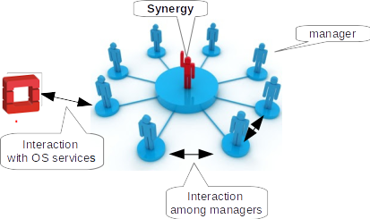

# About Synergy
In OpenStack based IaaS private clouds the computing and storage resources are statically partitioned among projects. A user typically is member of one project, and each project has its own fixed quota of resources defined by the cloud administrator. A user request is rejected if the project quota has been already reached, even if unused resources allocated to other projects would be available. This rigid resource allocation model strongly limits the global efficiency of the data centres, which aim to fully utilise their resources for optimizing costs. In the traditional computing clusters the utilisation efficiency is maximized through the use of a batch system with sophisticated scheduling algorithms plugged in.
**Synergy** is an advanced service interoperable with the OpenStack components, which implements a new resource provisioning model based on pluggable scheduling algorithms. It allows to maximize the resource usage, at the same time guaranteeing a _fair_ distribution of resources among users and groups. The service also provides a persistent queuing mechanism for handling those user requests exceeding the current overall resource capacity. These requests are processed according to a priority defined by the scheduling algorithm, when the required resources become available.

## The Synergy architecture
Synergy is an extensible general purpose management service designed for executing tasks in OpenStack. Its functionalities are provided by a collection of managers which are specific and independent pluggable tasks executed periodically, like the cron jobs, or interactively through a RESTful API. Different managers can coexist and they can interact with each other or with different OpenStack services in a loosely coupled way.

    

